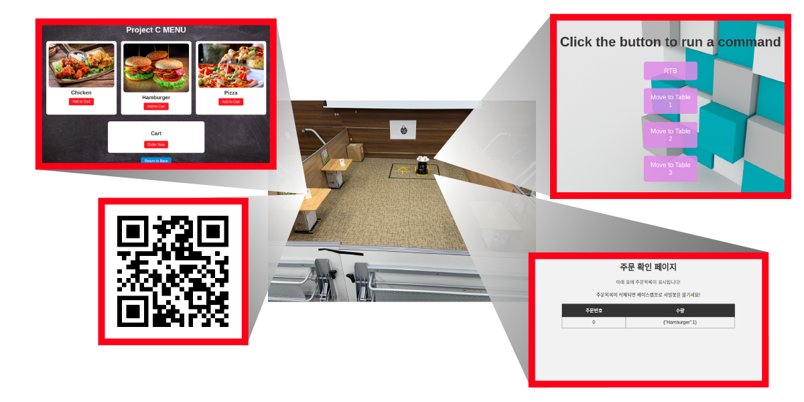
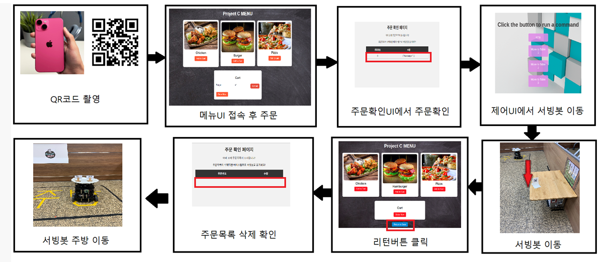

<!DOCTYPE html>
<html lang="ko">
<head>
<meta charset="UTF-8">
<meta name="viewport" content="width=device-width, initial-scale=1.0">
<title>Serving Robot Project</title>

</head>
<body>

  

    <h1>Serving Robot Project</h1>
  

  
  <!-- 구성도 섹션 -->
  

    <h2 class="section-heading">구성도</h2>
    

      
      
    

  

  
  <!-- 프로젝트 상세 섹션 -->
  

    <h2 class="section-heading">프로젝트 상세</h2>
    

      
<strong>수행기간:</strong> 2023. 10. 23 ~ 2023. 11. 24 (33일)

      
<strong>목적:</strong> 식당에서의 서빙인력을 로봇으로 대체

      <!-- 여기에 더 많은 프로젝트 세부 정보를 추가할 수 있습니다 -->
    

  

  
  <!-- 기타 섹션 -->
  <!-- 여기에 더 많은 섹션을 추가할 수 있습니다 -->
  

</body>
</html>
